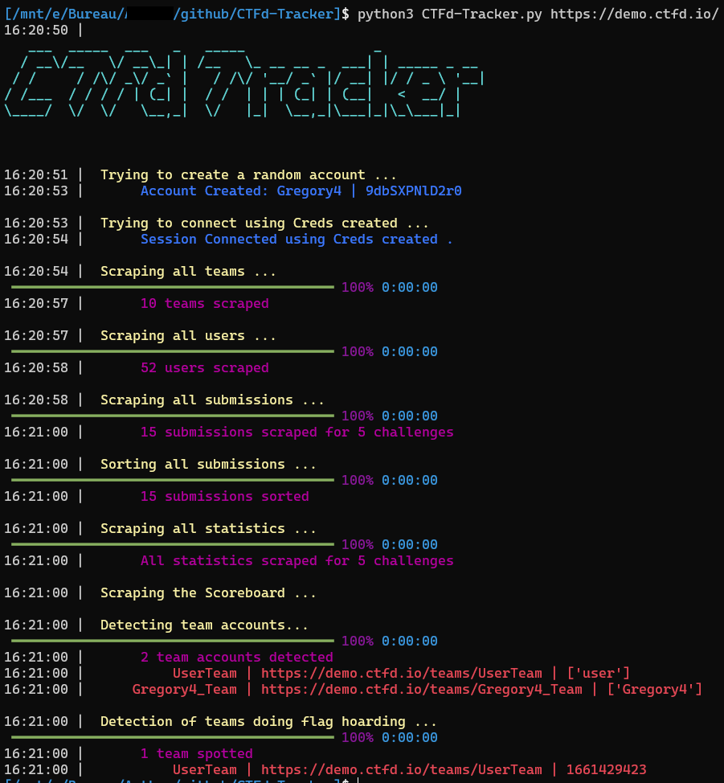

# CTFd-Tracker
This tool is used to detect cheater on ctf ctfd-based by creating score between differents teams.



This is the implementation of some anti-cheat techniques explained [here](https://vozec.fr/articles/anti-cheat-ctf/)  
All the techniques used here are **based on scrapping**.  
The tool can therefore be used **even if you are not an admin**

## Features
- Detection of team boosting
- Detection of team accounts
- Detection of teams doing flag hoarding

*(As all is based on external analysis, it is difficult to push the analysis further)*

### Team boosting
The tool creates a closeness score between each team and returns a sorted list of highest scores.
For each flag of a team, its score with the previous X teams is incremented with a value based on:
- Number of ``challenge points``
- ``Difference in flag time`` between the 2 teams
- ``Percentage of flag`` on the whole competition

The formula is currently:  
$$\frac{Points/10}{\Delta_t} * (1- \frac{N_{Flags}}{N_{Users}} )$$

*(This formula is in Beta version, do not hesitate to propose other things to improve it, whether at the level of the calculation or at the level of the parameters)*  

*(X is by default equal to 5 but it is changeable via the "-m" parameter)*

### Team accounts
Detection is based on **team names** and **usernames**.  
I am generating a lot of variation of team usernames and looking if any are included in the team name.

### Team doing flag hoarding

Detection is based on **flag times**.  
The tool averages all solve times and checks if this average is included in the last 8th of the competition time

## Installation
```bash
cd ~
git clonehttps://github.com/Vozec/CTFd-Tracker.git
cd CTFd-Tracker
python3 -m pip install -r requirements.txt
```

## Help
```bash
16:11:51 |
   ___  _____  ___   _   _____                _
  / __\/__   \/ __\_| | /__   \_ __ __ _  ___| | _____ _ __
 / /     / /\/ _\/ _` |   / /\/ '__/ _` |/ __| |/ / _ \ '__|
/ /___  / / / / | (_| |  / /  | | | (_| | (__|   <  __/ |
\____/  \/  \/   \__,_|  \/   |_|  \__,_|\___|_|\_\___|_|


usage: CTFd-Tracker.py [-h] [-t TOKEN] [-u USERNAME] [-p PASSWORD] [-m MAXDIFF] [-o OUTPUT] url

This tool is used to detect cheater on ctf ctfd-based by creating score between differents teams.

positional arguments:
  url          Ctfd Url

optional arguments:
  -h, --help   show this help message and exit
  -t TOKEN     CTFd Token to login
  -u USERNAME  CTFd Username
  -p PASSWORD  CTFd Password
  -m MAXDIFF   Maximum number of backtracks for each challenge check
  -o OUTPUT    Output Directory
```
To scrape the ctf, the tool needs to be connected.  
You can connect using: 
- ``credentials``
- ``API key``  

If you don't provide either ; an **account and a team will be randomly generated !**

## Example
```bash
python3 CTFd-Tracker.py https://demo.ctfd.io/
python3 CTFd-Tracker.py https://demo.ctfd.io/ -u admin -p password
python3 CTFd-Tracker.py https://demo.ctfd.io/ -t b0b27fe2a77b78645e52cd9518f82d058801295ec006537e7a551e8e392b5ccc
```

## Details
The tool will do these actions in order:  
- Login on the ctfd
- Scrape of all users
- Scrape of all teams
- Scrape of all submissions
- *(Scrape of the scoreboard)*
- Creation of score between different teams
- Creation of score between teams & users
- Detection of team accounts
- Detection of team teams doing flag hoarding
- Save of all data analyzed & scraped in json files 

## Results
All data analyzed & scraped are stored in json files:  
**Example**

#### Analyzed Data:
- *All_links_T2T.json* & *All_links_U2T.json*
```json
[
    [
        "Viral574",
        {
            "Art117": 3.769230769230769,
            "Cliche685": 0.1902834008097166
        }
    ],
    [
        "Art117",
        {
            "Wes499": 2.355769230769231,
            "Ennui185": 0.47115384615384615,
            "Echo194": 0.17636022514071295,
            "Viral574": 0.14177978883861236,
            "Cliche685": 0.08034188034188035
        }
    ],
    ...
]
```

- *Hoarding_teams.json*
  ```json
  {
      "hoarding_flag_team": [
          [
              "UserTeam",
              "https://demo.ctfd.io/teams/UserTeam",
              1661429423
          ]
      ]
  }
  ```

- *Shared_account.json*
  ```json
  {
      "shared_account": [
          {
              "team": "UserTeam",
              "link": "https://demo.ctfd.io/teams/UserTeam",
              "users": [
                  "user"
              ]
          },
          {
              "team": "Gregory4_Team",
              "link": "https://demo.ctfd.io/teams/Gregory4_Team",
              "users": [
                  "Gregory4"
              ]
          }
      ]
  }
  ```

#### Scraped Data:

- All_teams.json
```json
  {

      "Ennui185": {
          "fields": [],
          "bracket": null,
          "id": 1,
          "name": "Ennui185",
          "website": null,
          "oauth_id": null,
          "affiliation": null,
          "country": null,
          "members": [
              6,
              9,
              17,
              28,
              32,
              37,
              42,
              47
          ],
          "captain_id": 6,
          "place": "1st",
          "score": 364
      },
      ...
  }
```

- *All_users.json*
  ```json
  {
      "Mary": {
          "fields": [],
          "bracket": null,
          "id": 2,
          "name": "Mary",
          "website": null,
          "oauth_id": null,
          "affiliation": null,
          "country": null,
          "team_id": 8
      },
      ...
  }
  ```

- *All_solves.json*
```json
{
    "5": {
        "name": "The Lost Park",
        "category": "Forensics",
        "value": 50,
        "solves": [
            {
                "date": 1543200440,
                "team": "Ennui185",
                "team_id": 1,
                "solved_by": {
                    "name": "Louis",
                    "id": 9
                }
            },
            ...            
        ],
        "total_solves": 3,
        "percentage": 0.057692307692307696
    },
    ...
}
```

- Scoreboard.json
```json
[
    {
        "pos": 1,
        "account_id": 1,
        "account_url": "/teams/1",
        "account_type": "team",
        "oauth_id": null,
        "name": "Ennui185",
        "score": 364,
        "members": [
            {
                "id": 6,
                "oauth_id": null,
                "name": "Willie",
                "score": -8
            },
            ...
        ]
    },
    ...
}
```
